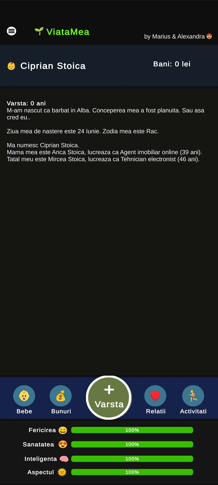

<h1>ViataMea Mobile Game - Unity C# Project</h1>
 
<h3>Features</h3>
<ul>
    <li>Start Button (new game) / Continue Button after exitting the game (saving preferences)</li>
    <li>Changing Name + randomize names based on gender choice</li>
    <li>Selecting a gender</li>
    <li>Choosing a county</li>
    <li>Typing your own city</li>
    <li>Choosing a talent or let it be none</li>
    <li>Slides with your % attributes values</li>
    <li>Main Menu with 2 options: New Life or Restart Your Life</li>
    <li>Randomize your birth reason and your parents names</li>
    <li>Real time stats about (happiness, healthines, smartness and looks) </li>
    <li>Plus Age Button</li>
    <li>Death Panel with details about what u did when you were alive</li>
    <li>Coming more soon..</li>
</ul>

<h2>Acknowledgments</h2>

<b> C#: https://bit.ly/csharp-certifications<b>
 

<h2>Photo</h2>

Mobile Application

 

<h2>Contact</h2>

<b> Email: mariusc0023@gmail.com </b>
